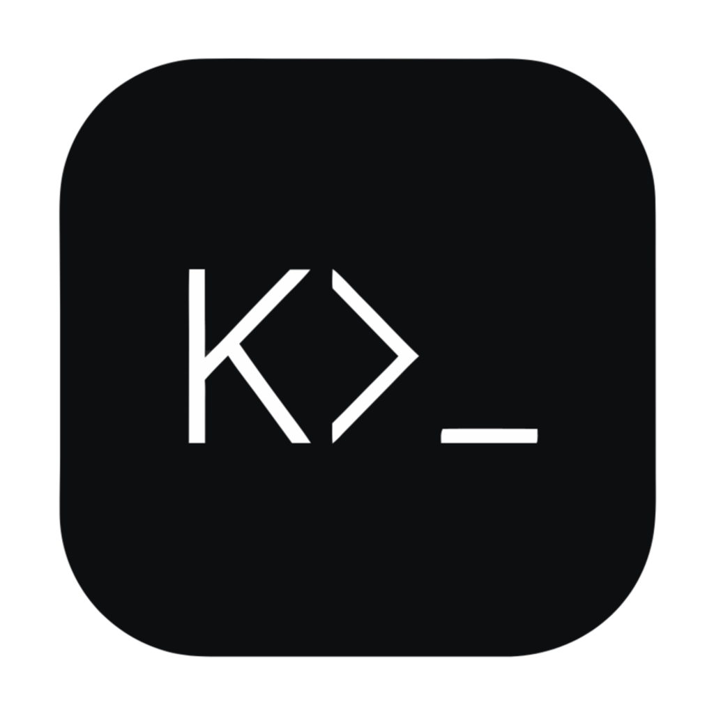

  

<h1 align="center">CLIk</h1>

<em>The clickable CLI — click commands instead of typing them.</em>

---

macOS Finder-style column GUI for the command line. Browse a CLI's command
tree as Miller columns, edit typed flags in a form, save and organize
commands into folders, and run them in real, interactive terminal tabs
(PTY-backed). macOS-first.

## Download

**➡️ [Download the latest release for macOS (Apple Silicon)](https://github.com/paputechxyz/clik/releases/latest)**

Grab the `CLIk-<version>-arm64.dmg` from the latest release, open it, and drag
**CLIk** to your Applications folder.

> **Unsigned build — one-time bypass.** CLIk is not code-signed or notarized,
> so macOS Gatekeeper will block the first launch ("cannot be opened because
> the developer cannot be verified", or a misleading "is damaged"). Clear it
> once with either:
>
> - **Right-click** CLIk → **Open** → **Open** on the prompt; or
> - in Terminal: `xattr -cr /Applications/CLIk.app`
>
> After that, the app and its in-app updates open normally.

In-app updates: open **Settings** (the gear icon) to see your version and
click **Check Updates** — newer versions download in the background and apply
on restart automatically.

## Features

- **Miller columns** — command tree discovered from each CLI's `--help`
  output; typed flags (bool / int / float / string / stringSlice) rendered as
  the right widgets with a live argv preview.
- **Saved library + folders** — bookmark any command (flags and positional
  args) as a snapshot and revisit it later. Organize saved commands into
  single-level folders, drag to reorder and move them between folders, and
  rename commands or folders inline — Postman-style collections for your CLI.
- **History** — every run is captured, newest first; click to reload a past
  command.
- **Real terminal tabs** — every tab is a PTY (`node-pty`) rendered with
  xterm.js: free typing, echo, TUIs, window resize, and kernel-handled
  `Ctrl+C` / `Ctrl+D`. `Cmd+T` opens a login-shell tab; `Cmd+W` closes it.
- **Shell env auto-load** — sources `~/.zshrc` (login + interactive) so CLIs
  see your real environment (PATH, `MY_TOKEN`, …).
- **PATH auto-scan** — discovers commands on your `PATH` and pre-fills binary
  paths from `which`; every path stays editable.
- **Refresh** — re-analyze a CLI after rebuilding it (drop the cached tree and
  re-parse every command + flag).
- Works with any command-line tool that exposes subcommands and flags via
  `--help` (`gh`, `docker`, `kubectl`, …).

## Commands

- `npm run dev` — launch the Electron app with hot reload
- `npm run build` — build main/preload/renderer to `out/`
- `npm run rebuild` — rebuild native modules (`node-pty`) against Electron's ABI
- `npm run build:mac` — build a macOS app dir to `dist/`
- `npm run typecheck` — `tsc --noEmit`
- `npm test` — run Vitest unit tests

## Architecture

- `src/main/` — Electron main: app/window/menu, IPC, `PtyManager` (`node-pty`),
  CLI registry, a `--help` adapter that parses help output into a typed
  command tree, saved-library persistence, shell-env capture, PATH scanner.
- `src/preload/` — contextBridge surface (`window.clik`); context
  isolation on, node integration off.
- `src/renderer/` — React UI: column navigator, flag panel, terminal tabs
  (xterm.js). State in Zustand.
- `src/shared/types.ts` — types shared across the three contexts.

Runs execute in a pseudo-terminal (`node-pty`): keystrokes flow
xterm → PTY (so `Ctrl+C` is delivered by the kernel's line discipline), and
closing a tab kills the PTY (SIGHUP). `--help` discovery and shell-env capture
use `child_process.spawn` with `shell: false`.

`node-pty` is a C++ native module — `npm run rebuild` rebuilds it against the
installed Electron (also runs on `postinstall`), and it is unpacked from the
asar at package time (`build.asarUnpack` in `package.json`).
