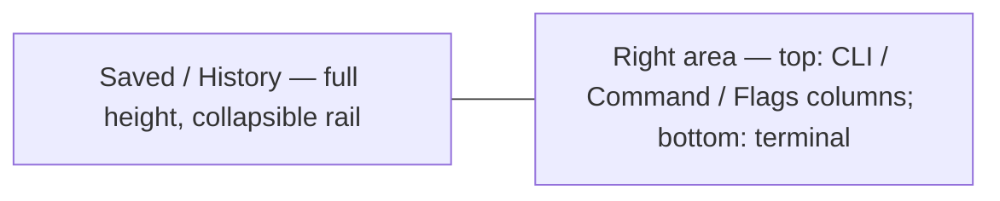

<!-- Product Contract preservation: unchanged. R-IDs, Flows, Acceptance Examples, and Scope Boundaries preserved as brainstormed. Planning resolved the one deferred question (see Outstanding Questions) and added the HOW below; it changed no product behavior. -->

# Saved Command Folders - Plan

## Goal Capsule

- **Objective:** Add Postman-style single-level folder organization (create, rename, drag-to-reorder, drag-into-folder) to the Saved panel, and restructure the app shell so the Saved/History column becomes a full-height left rail.
- **Product authority:** Owner directed the folder model, ordering, layout, and orphaned-command behavior during the brainstorm.
- **Open blockers:** None — all product decisions resolved and planned. Ready to implement.
- **Execution:** code

---

## Product Contract

### Summary

Single-level folders with manual drag-to-reorder for commands and folders, inline rename, and a confirm-with-count dialog when deleting a non-empty folder. The Saved/History column becomes a full-height left rail, pushing the terminal to the bottom-right.

### Problem Frame

The Saved panel is a flat, alphabetically-sorted list with no grouping, rename, or reordering. As the saved set grows across multiple CLIs, finding and grouping related command snapshots gets hard. The terminal currently claims the full window width at the bottom, squeezing the Saved panel into the top section beside the other columns. Folders need more room than that top sliver.

### Key Decisions

- **Single-level folders over nested.** A command groups under one axis only (one folder or root). Nested trees were rejected as overkill for CLI command snapshots.
- **Manual order over A–Z auto-sort.** Matches Postman; the current sort-on-save behavior is removed and the user controls position by dragging.
- **Full-height library rail.** The Saved/History column spans the whole window height on the left to give folders room. The terminal moves from full-width-bottom to bottom-right.
- **Keep saved commands on CLI removal.** Removing a CLI from the registry no longer deletes its saved commands. Orphaned commands stay visible and are a no-op when clicked.

### Requirements

**Folder organization**

- R1. Single-level folders group saved commands; a command lives at root or in exactly one folder, never nested inside another folder.
- R2. Folders can be created and renamed inline.
- R3. Dragging a saved command into a folder moves it there; dragging a command to root moves it out of its folder.
- R4. Commands and folders support manual drag-to-reorder within their location; folders reorder among themselves.
- R5. New saved commands land at the bottom of root.

**Rename**

- R6. Any saved command can be renamed inline. The History panel is unaffected.

**Delete**

- R7. Deleting an empty folder removes it without a prompt.
- R8. Deleting a folder that contains commands shows a confirmation naming the command count. Confirming deletes the folder and all commands inside; canceling keeps them.

**Orphaned commands**

- R9. Removing a CLI from the registry keeps its saved commands. Commands whose CLI no longer exists remain visible but do nothing when clicked.

**Layout**

- R10. The Saved/History column becomes a full-height left rail spanning the entire window height.
- R11. The CLI/Command/Flags columns occupy the top-right; the terminal occupies the bottom-right and no longer spans the full window width.
- R12. The rail remains collapsible to reclaim a full-width terminal.

Before: the library sat in the top section beside the other columns; the terminal spanned the full window width at the bottom. After: the library is a full-height left rail; the terminal gives up the left strip and sits bottom-right.

**Migration**

- R13. Existing saved commands migrate to root on first load, preserving their current order as the initial manual order so nothing visibly reflows.

### Key Flows

- F1. Create and populate a folder
  - **Trigger:** User wants to group saved commands.
  - **Steps:** Create folder via the Saved header, drag one or more commands into it, optionally rename the folder inline.
  - **Outcome:** Commands sit inside the folder; the folder can be collapsed, expanded, and reordered.
- F2. Rename a command or folder
  - **Trigger:** User invokes inline rename.
  - **Steps:** The name becomes an editable field; the user types and commits on blur/Enter, or cancels on Esc.
  - **Outcome:** The new name persists across reloads.
- F3. Delete a non-empty folder
  - **Trigger:** User deletes a folder that holds commands.
  - **Steps:** A confirmation appears naming the count; confirm deletes the folder and its contents, cancel keeps everything.
  - **Outcome:** Per R8.
- F4. Open an orphaned command
  - **Trigger:** User clicks a saved command whose CLI has been removed.
  - **Steps:** The click does nothing — no command loads, no error surfaces.
  - **Outcome:** Per R9.

### Acceptance Examples

- AE1. **Covers R7.** *Given* a folder is empty, *when* deleted, *then* it is removed with no prompt.
- AE2. **Covers R8.** *Given* a folder holds 3 commands, *when* deleted, *then* a confirmation says "3 commands will be deleted"; confirming removes the folder and all 3, canceling leaves them.
- AE3. **Covers R9.** *Given* a CLI was removed but its saved commands remain, *when* the user clicks one, *then* nothing happens.
- AE4. **Covers R5.** *Given* the user saves a command, *then* it appears at the bottom of root.

### Scope Boundaries

**Deferred for later**

- Nested folders (folders within folders).

**Outside this scope**

- Foldering or reordering the History panel — it stays flat and chronological.
- Tags or labels as an alternative or additional grouping mechanism.

### Dependencies / Assumptions

- The persisted library data (`userData/library.json` via `library:save` / `library:get`) must evolve to carry folders and manual order; older flat data upgrades on load (R13).
- Drag-and-drop targets live inside a narrow rail (default 220px, min 160px); the rail stays resizable.
- Folder expand/collapse state is expected to persist like the existing layout preferences; the exact storage is a planning detail.

### Outstanding Questions

- **Resolved in planning (was deferred to planning):** Folder expand/collapse state persists in the existing `clik-library-layout-v1` localStorage (alongside `savedCollapsed`/`historyCollapsed`/`width`). Collapsing the rail to a sliver does not collapse folders internally — folders keep their own expand/collapse state and reappear when the rail is expanded. See KTD4.

### Sources / Research

- `src/renderer/src/components/LibraryColumn.tsx` — current Saved/History panel: flat `<ul>`, A–Z display, collapse toggles, vertical resize between Saved and History.
- `src/renderer/src/store/useAppStore.ts` — `saveCurrentCommand` (sorts on save, L491), `removeEntry` (purges saved by `entryId`, L275), `persistLibrary`, `loadCommand`.
- `src/shared/types.ts` — `LibraryData`, `SavedCommandItem`, `HistoryItem`; `ClikApi.library.get/save`.
- `src/renderer/src/App.tsx` — `.body` splits `.columns-section` (top) from the `.output-section` terminal (bottom, full width).
- `src/renderer/src/components/ColumnNavigator.tsx` — `.columns` row holds `LibraryColumn` beside the CLI/Command/Flags panels.

---

## Planning Contract

### Key Technical Decisions

- **KTD1. Native HTML5 drag-and-drop (no new dependency).** The repo is lean (5 runtime deps) and already implements pointer-drag via a custom `Resizer`. For move-into-folder and list reordering, native HTML5 DnD (`draggable`, `onDragStart`/`onDragOver`/`onDrop`) matches the no-extra-library convention and needs no dependency. Drop intent (insert above/below an item vs drop-into a folder vs reorder folders) is computed from bounding-rect thresholds in `LibraryColumn`. Alternative considered: `@dnd-kit/core` for drag overlays and keyboard accessibility — rejected to keep the dependency surface flat; revisit only if the drag UX proves rough in practice.
- **KTD2. Folders and order modeled as a flat `saved[]` with `folderId`, plus a `folders[]` array.** `LibraryData` gains `folders: Folder[]` (`{ id, name }`) and each `SavedCommandItem` gains `folderId: string | null`. The `saved[]` array stays the single source of truth for command order — root order and per-folder order are both array position scoped by `folderId` (no per-item index field; reordering is array splicing). Folder display order is the `folders[]` array order. `Library` (main) defaults `folders: []` and `folderId: null` for older data on load, satisfying R13 with no visible reflow.
- **KTD3. Full-height rail via app-shell restructure, not CSS-only.** `LibraryColumn` currently renders inside `.columns` (`columns-section`, top). To span full height it moves out of `ColumnNavigator` to a direct flex child of `.body` (now `flex-direction: row`): `[rail | .body-right]`, where `.body-right` (`flex-direction: column`) holds the existing `columns-section` + Resizer + `output-section` split (`topWeight`/`bottomWeight` logic unchanged). The rail keeps its own width and collapse (already in `clik-library-layout-v1`); its right-edge `Resizer` becomes the rail↔right-area divider, and collapsing the rail reclaims a full-width right area (R12). This is structural (JSX moves across components), so it gets its own unit.
- **KTD4. Inline rename and delete-confirm as in-panel UI; folder state persisted.** Rename reuses the `ImportInput` inline pattern (double-click → controlled input, commit on blur/Enter, cancel on Esc). Delete-confirm reuses the `SettingsModal` overlay pattern, naming the count. Folder expand/collapse state persists in `clik-library-layout-v1`; collapsing the rail does not collapse folders internally (resolved Outstanding Question).
- **KTD5. Stop purging the library on CLI removal; orphaned loads stay no-ops.** `removeEntry` (`useAppStore.ts`) currently filters `saved` and `history` by `entryId`. Change it to keep both — orphaned saved commands are kept per R9, and orphaned history entries get the same treatment for consistency (their clicks already no-op via `loadCommand`'s early return when the entry is missing). History foldering/reorder remains out of scope.

### Assumptions

- The IPC surface for the library is opaque: `library:get` / `library:save` already pass the whole `LibraryData` object, so adding `folders` + `folderId` needs no new IPC channel or preload change — only the type, the main `Library` read/write, and the store.
- Component, drag-and-drop, and layout behavior verify via `npm run typecheck` and manual `npm run dev` runs; the vitest suite runs in a `node` environment and includes only `*.ts` files, so only store/persistence logic is unit-testable.

### Sequencing

U1 (data backbone + tests) first. U4 (app-shell rail) is independent of folders and can follow or parallelize. U2 (folder UI, rename, confirm) and U3 (DnD) build on U1 and live in `LibraryColumn.tsx`; do U2 then U3.

---

## Implementation Units

### U1. Library data model, persistence, migration, and store actions

- **Goal:** Carry folders + manual order through types, persistence, and the store; stop purging the library on CLI removal.
- **Files:** `src/shared/types.ts`, `src/main/library.ts`, `src/renderer/src/store/useAppStore.ts`.
- **Patterns:** `Library` class read/write with `Array.isArray` guards (`src/main/library.ts`); `persistLibrary` / `loadLibrary` and existing `saveCurrentCommand` / `removeSaved` / `removeEntry` (`useAppStore.ts`); existing store test mocking via `installApi` (`src/renderer/src/store/__tests__/useAppStore.test.ts`).
- **Changes:**
  - types: add `Folder { id: string; name: string }`; add `folderId: string | null` to `SavedCommandItem`; add `folders: Folder[]` to `LibraryData`.
  - `library.ts`: back-compat — default `folders: []`, default each item's `folderId` to `null`; `set()` validates `folders` like it validates `saved`/`history`.
  - store: `loadLibrary` reads `folders`; new actions `addFolder(name)`, `renameFolder(id, name)`, `removeFolder(id)` (deletes the folder and every item with matching `folderId`), `moveCommand(id, folderId | null, index)`, `reorderWithin(location, fromIndex, toIndex)`, `renameSaved(id, name)`; `saveCurrentCommand` appends at the end of `saved` with `folderId: null` and drops the `.sort()` (R5); `removeEntry` stops filtering `saved`/`history` (R9).
- **Test scenarios (store-level, vitest):**
  1. Old data (`{ saved: [item], history: [] }`, no `folders`, no `folderId`) loads as `folders: []` with the item's `folderId: null`.
  2. `addFolder` appends to `folders` and persists via `library.save`.
  3. `renameFolder` updates the name and persists.
  4. `removeFolder('f1')` deletes folder `f1` and all items whose `folderId === 'f1'`, leaving other folders and items intact.
  5. `moveCommand` sets `folderId` and repositions within `saved` (into-folder and out-to-root cases).
  6. Reorder within a folder does not cross folder boundaries (root items and a folder's items each stay ordered independently).
  7. `saveCurrentCommand` appends at the END of root (no A–Z sort), with `folderId: null`.
  8. `removeEntry('e1')` keeps `saved` and `history` items whose `entryId === 'e1'` (orphaned).
- **Verification:** `npm test`, `npm run typecheck`.

### U2. Saved panel folder UI, inline rename, create, and delete-confirm

- **Goal:** Render folders + nested commands, inline rename for both, create folder, and the count-named delete confirmation (R1, R2, R6, R7, R8; orphan display for R9).
- **Files:** `src/renderer/src/components/LibraryColumn.tsx`, `src/renderer/src/styles.css`. Consumes U1 store actions.
- **Patterns:** existing `lib-panel` / `lib-list` / `lib-item` rendering; `ImportInput` inline input (focus/Enter/Esc) for rename; `SettingsModal` overlay for the confirm modal; `clik-library-layout-v1` localStorage for persisted layout.
- **Changes:**
  - Render root commands first, then folders; each folder is a collapsible group (chevron toggle) listing its commands.
  - New-folder button in the Saved header.
  - Inline rename for commands and folders: double-click name → input (commit blur/Enter, cancel Esc).
  - Delete folder: empty → remove directly (R7); non-empty → confirm modal naming the count, e.g. "N commands will be deleted" (R8).
  - Persist folder expand/collapse state in `clik-library-layout-v1` (KTD4); orphaned commands (entry missing) render but click does nothing.
  - Remove the "A–Z" header note (manual order now).
- **Test scenarios:** UI is not covered by the `node`/`*.ts` vitest suite; verify via `npm run typecheck` and manual `npm run dev`: create folder, expand/collapse (persists across reload), rename command + folder, delete empty vs non-empty (confirm count), orphaned command click is a no-op.
- **Verification:** `npm run typecheck`, manual.

### U3. Drag-and-drop reorder and move-into-folder

- **Goal:** Manual drag-to-reorder within a location and drag a command into/out of folders, plus folder reordering (R3, R4).
- **Files:** `src/renderer/src/components/LibraryColumn.tsx` (DnD handlers + drop indicators), `src/renderer/src/styles.css` (drag-over / placeholder / drop-target styles).
- **Patterns:** native HTML5 DnD (KTD1); the existing `Resizer` pointer-drag is unrelated (resize, not reorder) but confirms the no-DnD-library convention.
- **Changes:**
  - `draggable` on each command and folder; `onDragStart` stashes the dragged id + kind (command/folder); `onDragOver` computes drop intent (insert above/below an item, drop-into a folder header, reorder folders) from a bounding-rect threshold; `onDrop` calls the U1 `moveCommand` / reorder actions.
  - Visual feedback: insertion-line placeholder and folder-as-drop-target highlight.
- **Test scenarios:** DnD is UI interaction; the underlying move/reorder logic is covered by U1 tests. Verify via `npm run typecheck` and manual `npm run dev`: reorder root items, reorder within a folder, drag command into a folder, drag command out to root, reorder folders.
- **Verification:** `npm run typecheck`, manual.

### U4. Full-height library rail layout

- **Goal:** Saved/History column spans the full window height; terminal moves to bottom-right; rail stays collapsible (R10, R11, R12).
- **Files:** `src/renderer/src/App.tsx`, `src/renderer/src/components/ColumnNavigator.tsx`, `src/renderer/src/styles.css`. `LibraryColumn` keeps its own width/collapse via `clik-library-layout-v1`.
- **Patterns:** existing flex app shell (`.app` / `.body` / `.columns-section` / `.output-section`); `useLayoutStore` `topWeight` / `bottomWeight` resizer.
- **Changes:**
  - `App.tsx`: `.body` becomes `flex-direction: row` — `<LibraryColumn />` (rail, full height) + `<section className="body-right">` (`flex-direction: column`: `columns-section` [top] + the existing horizontal `Resizer` + `output-section` [terminal, bottom]).
  - `ColumnNavigator`: remove `<LibraryColumn />` from the `.columns` render (it is now a sibling at body level).
  - CSS: `.body` row; `.body-right` column `flex: 1 1 0`; `.library-column` keeps full height (flex column; the new row parent gives it full height); rail collapse (`flex: 0 0 24px`) reclaims width for `.body-right` (R12).
  - The `topWeight`/`bottomWeight` resizer now divides `.body-right` (columns vs terminal) — logic unchanged, new container.
- **Test scenarios:** structural layout with no node-level test; verify via `npm run typecheck` and manual `npm run dev`: rail spans full height, terminal sits bottom-right, resize rail width, collapse rail → full-width right area, resize columns↔terminal split.
- **Verification:** `npm run typecheck`, manual.

---

## Verification Contract

| Command | Applies to | Verifies |
|---|---|---|
| `npm test` | U1 | store folder CRUD, move/reorder, migration, no-purge, save-at-bottom |
| `npm run typecheck` | U1–U4 | types across `src/shared`, `src/main`, `src/renderer` |
| `npm run dev` (manual) | U2, U3, U4 | folder UI, inline rename, delete-confirm, drag reorder/move, rail layout |

---

## Definition of Done

- R1–R13 satisfied; AE1–AE4 behave as specified.
- `npm test` green — new store tests for migration, folder CRUD, move/reorder, no-purge on CLI removal, and save-at-bottom.
- `npm run typecheck` clean.
- Manual pass: create/rename/delete folders (empty and non-empty confirm), drag to reorder and to move commands in/out of folders, rail spans full height and collapse reclaims width, terminal sits bottom-right, existing saved data migrates invisibly, clicking an orphaned command does nothing.
