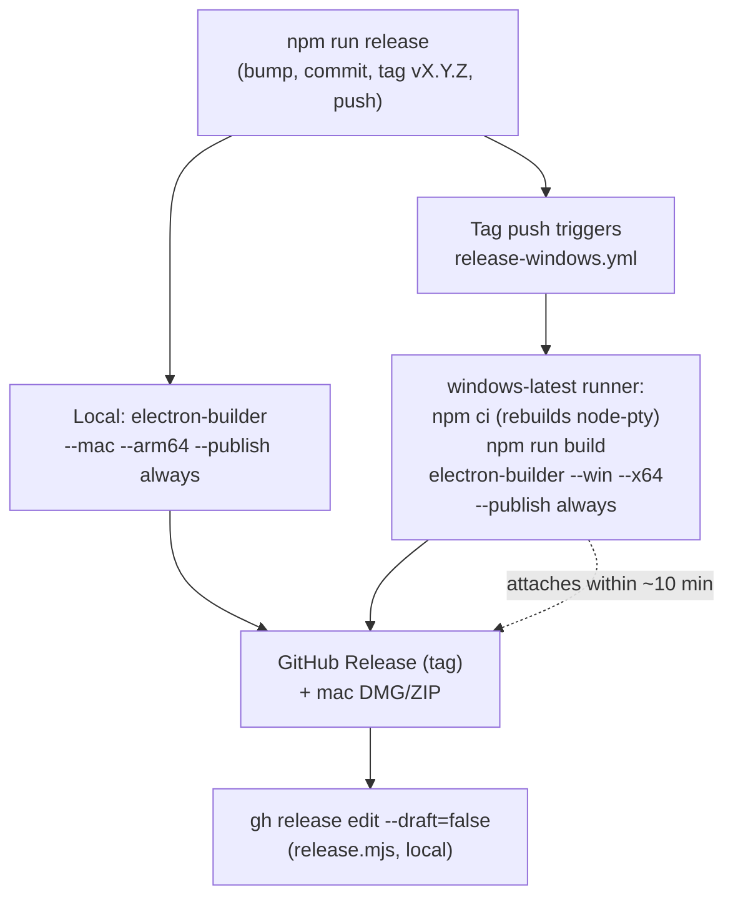

## Goal Capsule

- Objective: Make CLIk build and run on Windows x64, and make a Windows installer artifact part of `npm run release`.
- Product authority: project owner (solo), macOS-first. Scope confirmed: Windows x64 only, unsigned build, cmd.exe default shell, Windows artifact produced via CI.
- Execution profile: standard. Platform-runtime code changes (unit-testable on macOS via platform mocking), build config, a new CI workflow, and docs.
- Stop conditions: Windows CI workflow runs green on a release tag and attaches an NSIS installer to the GitHub release; the macOS flow is unchanged; all unit tests pass.
- Tail ownership: the implementer lands all units; the first real `npm run release` after merge is the end-to-end proof.

---

## Product Contract

### Summary

Add Windows x64 as a supported build-and-release target for CLIk. The Windows runtime adapts the platform-specific layers (shell-environment model, executable resolution, interactive shell tabs, window/menu styling) so the app functions on a stock Windows machine. The Windows installer is produced by a GitHub Actions Windows runner triggered by the version tag that `npm run release` already pushes — the macOS build stays local and unchanged.

### Problem Frame

CLIk is macOS-only today. Every release artifact targets Apple Silicon; the build config has no Windows target; and the runtime code assumes zsh, Unix exec-bit permissions, and macOS window/menu conventions. The `node-pty` native module (the terminal backend) cannot be cross-compiled from macOS to Windows, so the Windows binary must be built on a Windows machine. The user has no Windows machine, so the release must produce the Windows artifact without one. This plan closes that gap: a Windows build target, platform-aware runtime code, a CI workflow that compiles the native module on Windows, and documentation for the unsigned-build SmartScreen bypass that mirrors the existing macOS Gatekeeper guidance.

### Requirements

**Release & packaging**

- R1. `npm run release` produces a Windows x64 NSIS installer in addition to the macOS arm64 artifacts, attached to the same GitHub release.
- R2. The Windows build is reproducible via CI on a Windows runner, requiring no Windows machine locally.
- R3. In-app auto-update works on Windows: the Settings "Check Updates" flow downloads a newer Windows release and applies it on restart via electron-updater + NSIS.

**Runtime — shell & environment**

- R4. On Windows, the app uses the inherited process environment directly rather than spawning a login shell to capture it, because Windows GUI apps receive a full environment (no macOS launchd minimal-env problem).
- R5. Opening a new terminal tab on Windows spawns `cmd.exe` at the user's home directory (the macOS login-zsh tab has no Windows equivalent).

**Runtime — discovery & resolution**

- R6. PATH scanning and binary resolution discover Windows executables by probing PATHEXT extensions (`.exe`, `.cmd`, `.bat`, `.ps1`) rather than checking a Unix exec bit.
- R7. `--help` discovery works for Windows executables, including `.cmd`/`.bat` shims, so CLIs like `npm`/`pnpm` resolve and parse.

**Documentation**

- R8. The README documents the Windows download and the one-time unsigned-build SmartScreen bypass.

### Key Decisions

- **Windows artifact via CI, not local cross-compile.** `node-pty` is a C++ native module and cannot be cross-compiled from macOS to Windows (electron-builder pretends to rebuild but emits a broken binary — see Sources). A GitHub Actions Windows runner, triggered by the release tag, is the only viable path. Rejected: switching to a prebuilt-multiarch `node-pty` fork (uncertain Electron 33 prebuild coverage; risks the working macOS build).
- **Unsigned build, documented SmartScreen bypass.** Consistent with the existing unsigned macOS approach. SmartScreen warns on first launch; the README documents the "More info → Run anyway" bypass. In-place auto-update still works because the already-running app performs the swap.
- **cmd.exe as the default interactive shell.** Always present on Windows, most compatible. PowerShell deferred as a future option.
- **macOS build stays local.** The existing local `electron-builder --mac --arm64` flow is unchanged. Moving it to CI is deferred (out of scope).

### Acceptance Examples

- AE1. **Release produces both artifacts.** Given `npm run release` on macOS, when the command completes, then the macOS DMG is on the GitHub release immediately and the Windows installer appears on the same release within ~10 minutes via CI.
- AE2. **App boots on Windows.** Given a stock Windows 11 machine, when the user installs and launches CLIk, then the column UI appears, the user can add a CLI, browse its command tree, and run a command in a terminal tab.
- AE3. **New tab is cmd.exe.** Given the app running on Windows, when the user opens a new tab (Ctrl+T), then a `cmd.exe` prompt opens at the user's home directory.
- AE4. **PATH resolution finds Windows executables.** Given `gh` is installed on Windows, when the user adds it by name, then the path resolves to `gh.exe` on PATH via PATHEXT.
- AE5. **Auto-update on Windows.** Given a newer Windows release exists, when the user clicks Check Updates, then it downloads and "Restart to Update" applies the new version.

### Scope Boundaries

#### Deferred for later

- Windows code signing / EV certificate / SmartScreen reputation building.
- Windows ARM64 target.
- Linux build and release.
- Moving the macOS build into CI (for full release reproducibility).
- Differential/blockmap-optimized Windows updates.
- PowerShell as a selectable interactive shell.

#### Outside this product's identity

- A paid or code-signed Windows distribution tier.

### Dependencies / Assumptions

- The GitHub repo (`paputechxyz/clik`) is public so Releases are reachable by downloaders and the in-app updater.
- The GitHub Actions default `GITHUB_TOKEN` (with `contents: write`) is sufficient for the Windows runner to publish to the tag's release — no extra secret beyond what CI already provides.
- `windows-latest` runners carry the VS build toolchain needed for `node-pty`'s native compile, and Node 22 (matching `ci.yml`).
- The user cannot verify the Windows runtime locally; the verification bar is a green Windows CI build producing a valid installer, plus unit-tested platform branches.

### Sources / Research

- `package.json` — `build.mac` (arm64 dmg/zip), `asarUnpack` for node-pty, `scripts.release` → `scripts/release.mjs`; no `win` target today.
- `scripts/release.mjs` — bumps semver, commits, tags `vX.Y.Z`, pushes, then `electron-builder --mac --arm64 --publish always`, then `gh release edit --draft=false`.
- `scripts/after-pack.js` — macOS-only ad-hoc signing; already early-returns for non-darwin.
- `src/main/shell-env.ts` — `defaultShell()` → `$SHELL || /bin/zsh`; `captureShellEnv()` spawns `<shell> -lic` with `/usr/bin/env` (zsh/posix-only).
- `src/main/ipc.ts` — `pty:openShell` spawns `shellEnv.shell || $SHELL || /bin/zsh` with `['-l']`.
- `src/main/scanner.ts` — `resolveOnPath` checks `X_OK` + `mode & 0o111` (Unix exec bit; meaningless on Windows).
- `src/main/adapter/cobra.ts` — `runHelp` uses `spawn(binaryPath, [...cmdPath, '--help'], { shell: false })`; `.cmd`/`.bat` need `cmd.exe /c` on Windows.
- `src/main/index.ts` — `titleBarStyle: 'hiddenInset'` (macOS-only); `app.dock?.setIcon` already optional-chained.
- electron-builder issue #8020 — maintainer-confirmed: native dependencies cannot be cross-compiled for Windows from Mac/Linux; must be compiled on the target platform.
- electron-builder issue #8613 — NSIS-on-CI ENOENT; closed as not-planned/stale (transient cache-download issue, not a fundamental blocker; electron-builder auto-downloads NSIS to its cache on a clean runner).

---

## Planning Contract

### Key Technical Decisions

- **KTD1. CI-built Windows artifact (release architecture).** `npm run release` keeps its local macOS build phase. The version-tag push triggers a Windows CI job that compiles `node-pty` natively and runs `electron-builder --win --x64 --publish always`, attaching the installer + `latest.yml` to the same tag-keyed release. Rationale: node-pty cannot cross-compile (Sources #8020); CI is the only no-Windows-machine path. See High-Level Technical Design.
- **KTD2. Skip shell-env capture on Windows.** `ShellEnvCache.refresh()` on win32 resolves immediately with `process.env` (sets `ready = true`, no spawn). Windows GUI processes inherit the full user+system environment from the registry, so the launchd minimal-env problem that motivates the macOS zsh capture does not exist on Windows. The posix capture path is untouched.
- **KTD3. cmd.exe default interactive shell.** `pty:openShell` on win32 spawns `process.env.COMSPEC || 'cmd.exe'` with no login flag, cwd = homedir. Most compatible; PowerShell deferred.
- **KTD4. PATHEXT extension probing.** `resolveOnPath` on win32, for a bare name, appends each PATHEXT extension in order and checks file existence (Windows has no meaningful exec bit; `accessSync(X_OK)` on Windows checks read access, not executability). For a direct path lacking an extension, probe the same extensions. The posix exec-bit path is untouched.
- **KTD5. `.cmd`/`.bat` discovery via explicit `cmd.exe /c`.** `runHelp` on win32, when the binary path ends in `.cmd`/`.bat`, spawns `cmd.exe` with argv `['/c', binaryPath, ...cmdPath, '--help']` and `shell: false`. This honors the repo's "never `shell: true`" convention (AGENTS.md) while satisfying Node's Windows requirement that `.cmd`/`.bat` execute through `cmd.exe`. `.exe` binaries spawn directly as today.
- **KTD6. Platform-guarded window/menu styling.** `titleBarStyle: 'hiddenInset'` is applied only on darwin (it is ignored on Windows but guarding it is explicit). The macOS `appMenu`/`Window` menu roles are darwin-only; the cross-platform Shell menu (New/Close/Clear Tab with `CmdOrCtrl` accelerators) is shared. Minimal change, no new abstraction.
- **KTD7. NSIS oneClick installer.** Windows target is `nsis` for `x64`. `oneClick: false` with install-directory choice keeps parity with a normal Windows installer; electron-updater supports NSIS for auto-update.

### High-Level Technical Design

The release pipeline splits into a local macOS phase (unchanged) and a parallel Windows CI phase (new), both keyed to the same git tag:

The runtime platform-branching is localized to four modules, each guarded by `process.platform` checks that leave the posix path byte-identical:

- **shell-env** — win32 short-circuits to `process.env`; posix keeps the zsh capture.
- **scanner** — win32 probes PATHEXT; posix checks the exec bit.
- **adapter** — win32 routes `.cmd`/`.bat` through `cmd.exe /c`; posix/`.exe` spawn directly.
- **ipc openShell** — win32 spawns `cmd.exe`; posix spawns the login shell.

### Assumptions

- Windows ConPTY (node-pty's Windows backend) is available on all `windows-latest` runner images (Windows 1809+) and on any realistic user machine (Windows 10 1809+ / Windows 11).
- electron-builder downloads NSIS to its cache on first Windows CI run without manual setup (issue #8613 was a transient cache miss, closed as not-planned).
- The macOS local build and the Windows CI build will not collide on release creation: electron-builder creates-or-updates the tag-keyed release, so whichever finishes first creates it and the other attaches.
- PATHEXT is present in `process.env` on Windows; a hardcoded fallback (`.EXE;.CMD;.BAT`) covers the rare case it is unset.

---

## Implementation Units

### U1. Windows shell-environment model and interactive shell

**Goal:** Make the shell-env cache and the "new tab" PTY shell work on Windows without spawning a nonexistent zsh.

**Requirements:** R4, R5

**Dependencies:** none

**Files:**
- `src/main/shell-env.ts` (modify)
- `src/main/ipc.ts` (modify — `pty:openShell`)
- `src/main/__tests__/shell-env.test.ts` (modify — add Windows-branch cases)

**Approach:** Add a platform check in `shell-env.ts`. On `process.platform === 'win32'`, `defaultShell()` returns `process.env.COMSPEC || 'cmd.exe'`, and `ShellEnvCache.refresh()` resolves immediately with a copy of `process.env`, sets `ready = true`, `shell` to the cmd path, and never calls `captureShellEnv`. The existing `captureShellEnv`/`parseEnvBlock` stay posix-only and unchanged. In `ipc.ts`, make `pty:openShell` platform-conditional: win32 spawns `{ file: process.env.COMSPEC || 'cmd.exe', args: [], cwd: os.homedir(), env: {} }`; posix keeps the current `shellEnv.shell || $SHELL || '/bin/zsh'` with `['-l']`.

**Patterns to follow:** The existing `ShellEnvCache` fallback in `ipc.ts` (`.catch(() => { /* stays process.env */ })`) already treats `process.env` as the fallback — promote it to the primary win32 path. Mirror the `process.platform === 'darwin'` guard already in `index.ts`.

**Test scenarios:**
- `defaultShell()` returns `cmd.exe` (or COMSPEC) when platform is win32 — mock `process.platform`.
- `ShellEnvCache.refresh()` on win32 resolves with `process.env`, sets `ready = true`, and does not invoke `spawn` (assert no child process) — platform-mocked.
- `parseEnvBlock` and the posix `captureShellEnv` live path are unchanged (regression — existing tests pass unmodified).
- `pty:openShell` on win32 opens a PTY with `cmd.exe` and no `-l` flag — assert via the mocked `pty.spawn` arguments (extend the `pty.ts` test harness pattern).

**Verification:** `npm test` passes with the new Windows-branch cases; the posix path is byte-identical (diff shows only additive `if (win32)` guards).

---

### U2. Windows-aware PATH and executable resolution

**Goal:** `resolveOnPath` and `scanCandidates` find Windows executables by extension, since the Unix exec-bit check is meaningless on NTFS.

**Requirements:** R6

**Dependencies:** none

**Files:**
- `src/main/scanner.ts` (modify)
- `src/main/__tests__/scanner.test.ts` (modify — add Windows cases)

**Approach:** In `resolveOnPath`, branch on platform. On win32, resolve the PATHEXT list from `env.PATHEXT` (fallback `'.EXE;.CMD;.BAT'`). For a bare name (no separator), try `name + ext` for each extension and return the first that exists as a file (use `fs.statSync` existence, not the exec bit). For a direct path: if it already has an extension and exists, return it; if no extension, probe PATHEXT. On posix, keep the current `X_OK` + `mode & 0o111` check unchanged. `path.delimiter` (`;` on win32 / `:` on posix) is already handled by Node.

**Patterns to follow:** The existing loop over `pathVar.split(path.delimiter)`; mirror its error-swallowing `try/catch` per candidate.

**Test scenarios:**
- Bare name `gh` resolves to `gh.exe` on win32 when `gh.exe` exists in a PATH dir (synthetic env + temp dir fixture).
- Bare name resolves `.cmd` when `.exe` is absent, respecting PATHEXT order.
- Direct path `C:\tools\foo.exe` resolves; `C:\tools\foo` (no ext) probes extensions.
- Nonexistent name returns null on win32.
- posix regression: existing `resolveOnPath('/bin/sh', ENV)` and exec-bit tests pass unchanged (platform not win32).
- `scanCandidates` dedup and DEFAULT_CANDIDATES behavior unchanged.

**Verification:** `npm test` passes; scanner unit tests cover both platform branches.

---

### U3. Windows `--help` discovery for .cmd/.bat shims

**Goal:** CLI discovery (`--help` parsing) works for `.cmd`/`.bat` shims like `npm` and `pnpm` on Windows by routing them through `cmd.exe`.

**Requirements:** R7

**Dependencies:** U2 (the resolved path may carry a `.cmd`/`.bat` extension)

**Files:**
- `src/main/adapter/cobra.ts` (modify — `runHelp`)
- `src/main/adapter/__tests__/cobra.test.ts` (modify — add argv-construction test if `runHelp`'s spawn args are extractable; otherwise document)

**Approach:** In `runHelp`, on win32, inspect the binary path's extension. If it ends in `.cmd` or `.bat`, build the spawn as `spawn(process.env.ComSpec || 'cmd.exe', ['/c', binaryPath, ...cmdPath, '--help'], { shell: false })`. For `.exe` or no-special-extension, keep the current direct `spawn(binaryPath, [...cmdPath, '--help'], { shell: false })`. Extract the argv-building into a small pure helper so it is unit-testable without spawning. This respects AGENTS.md's "never `shell: true`" rule by passing an explicit argv to `cmd.exe`.

**Patterns to follow:** The existing `runHelp` timeout/error/settled pattern; the argv-array discipline documented in AGENTS.md.

**Test scenarios:**
- The argv helper returns `['cmd.exe', '/c', 'npm.cmd', '--help']` for a `.cmd` binary on win32 ( Covers R7).
- The argv helper returns `['gh.exe', '--help']` for an `.exe` binary on win32.
- On posix, the helper returns the unchanged `[binaryPath, ...cmdPath, '--help']` (regression).
- `parseHelp` behavior is unchanged by this unit (its existing fixture tests pass).

**Execution note:** This is an edge case — the primary CLIs (`gh`, `docker`, `kubectl`, `git`) are `.exe` on Windows and already work with `shell: false`. Smoke-verify a `.cmd` CLI on the Windows runner if one is registered during dogfooding.

**Verification:** `npm test` passes; the argv helper is covered. Full `--help` round-trip for a `.cmd` binary is confirmed on the Windows runner.

---

### U4. Platform-conditional window and menu styling

**Goal:** The window title bar and application menu render appropriately on Windows without changing the macOS experience.

**Requirements:** R2 (functional boot)

**Dependencies:** none

**Files:**
- `src/main/index.ts` (modify — `createWindow`)
- `src/main/menu.ts` (modify — `buildMenu`)

**Approach:** In `createWindow`, set `titleBarStyle: 'hiddenInset'` only when `process.platform === 'darwin'`; omit it (default title bar) on Windows. In `buildMenu`, gate the macOS-specific `appMenu` role and the `Window` submenu (with `front`) behind a darwin check; keep the cross-platform Shell menu (New/Close/Clear Tab with `CmdOrCtrl` accelerators) and the `viewMenu`/`editMenu` roles shared. `app.dock?.setIcon` is already optional-chained and stays darwin-only.

**Patterns to follow:** The existing `process.platform === 'darwin'` guard in `index.ts` (dock icon); the `CmdOrCtrl` accelerator convention already in `menu.ts`.

**Test scenarios:** Test expectation: none — platform-conditional window/menu configuration; verified at runtime on the Windows runner (visual + menu structure). No behavioral logic to assert beyond the config branching.

**Verification:** The Windows runner build launches a window with a standard title bar and an operational Shell menu; macOS is visually unchanged.

---

### U5. electron-builder Windows target config and icon

**Goal:** Declare the Windows NSIS x64 build target and provide a Windows icon so electron-builder can package a valid installer.

**Requirements:** R1, R3

**Dependencies:** none

**Files:**
- `package.json` (modify — `build.win`, `build.nsis`, `build.win.icon`)
- `build/icon.ico` (new — generated from `src/logo.png`)

**Approach:** Add a `win` block to the `build` config: target `nsis` for arch `x64`, icon `build/icon.ico`. Add an `nsis` block: `oneClick: false`, `perMachine: false`, `createDesktopShortcut: true`, `createStartMenuShortcut: true`. The existing `asarUnpack` (`**/node_modules/node-pty/**`) already covers Windows. Generate `build/icon.ico` from `src/logo.png` (a multi-resolution `.ico`; if no conversion tool is available in-repo, electron-builder accepts a 256×256 PNG and auto-converts — point `win.icon` at the PNG as a fallback). Keep `afterPack` (`scripts/after-pack.js`) as-is; it already early-returns for non-darwin.

**Patterns to follow:** The existing `mac` block structure (target array + arch + icon + category).

**Test scenarios:** Test expectation: none — build configuration; verified by the Windows CI build (U6) producing a valid `CLIk-<version>-setup.exe`.

**Verification:** `electron-builder --win --x64` on the Windows runner produces an NSIS installer with the correct icon and appId.

---

### U6. Windows release CI workflow

**Goal:** Produce the Windows x64 NSIS installer on a Windows runner and attach it (plus `latest.yml` for auto-update) to the version-tag GitHub release.

**Requirements:** R1, R2, R3

**Dependencies:** U5 (the `win`/`nsis` build config must exist)

**Files:**
- `.github/workflows/release-windows.yml` (new)

**Approach:** Trigger on `push: tags: ['v*']`. Job runs on `windows-latest`, Node 22 (matching `ci.yml`), with `permissions: { contents: write }`. Steps: checkout, setup-node (cache npm), `npm ci` (postinstall runs `electron-rebuild` which compiles node-pty for Windows Electron), `npm run build`, `electron-builder --win --x64 --publish always` (publishes to the tag's release using `GITHUB_TOKEN`). The tag is created by `release.mjs` on macOS; this job fires automatically and attaches the installer to the same tag-keyed release electron-builder creates-or-updates.

**Patterns to follow:** The existing `ci.yml` (Node 22, npm cache, `npm ci`); electron-builder's `--publish always` convention already used by `release.mjs` for macOS.

**Test scenarios:** Test expectation: none — CI workflow YAML; verified by the workflow running green on the next release tag.

**Execution note:** Validate the workflow YAML with `actionlint` if available; the real proof is the first tagged release producing a green build + attached installer.

**Verification:** On the first `npm run release` after merge, the `release-windows.yml` workflow succeeds and the GitHub release carries `CLIk-<version>-setup.exe` and `latest.yml`.

---

### U7. Release-script wiring and documentation

**Goal:** Tie the Windows CI into the release narrative, document the Windows download and SmartScreen bypass, and record the Windows build model in AGENTS.md.

**Requirements:** R1, R8

**Dependencies:** U6 (documents the CI workflow)

**Files:**
- `scripts/release.mjs` (modify — log message after undraft)
- `README.md` (modify — Windows download + SmartScreen note)
- `AGENTS.md` (modify — Windows build notes)

**Approach:** In `release.mjs`, after `gh release edit --draft=false`, print a clear note that the Windows build runs via the `release-windows.yml` workflow (triggered by this tag) and will attach the installer within ~10 minutes. In `README.md`, add a Windows download line alongside the macOS line (the releases-latest page serves both platforms), and a SmartScreen bypass note ("Windows protected your PC" → More info → Run anyway) mirroring the macOS Gatekeeper block. In `AGENTS.md`, add a short section on the Windows build model: CI-built, node-pty cross-compile constraint, ConPTY, cmd.exe default shell, PATHEXT resolution.

**Patterns to follow:** The existing README macOS download + Gatekeeper block structure; AGENTS.md section style.

**Test scenarios:** Test expectation: none — documentation and a log message; verified by reading.

**Verification:** README renders both platform download paths; `release.mjs` output references the Windows CI workflow by name.

---

## Verification Contract

| Gate | Command / signal | Scope |
|---|---|---|
| Typecheck | `npm run typecheck` | All units — must pass before merge |
| Unit tests | `npm test` | U1, U2, U3 (platform branches); all existing tests remain green |
| macOS regression | `npm run build` + `npm run build:mac` | U1–U4, U7 — posix path unchanged, local mac build still works |
| Windows CI build | `release-windows.yml` green on `v*` tag | U5, U6 — produces a valid NSIS installer |
| End-to-end release | First `npm run release` after merge | U6, U7 — both artifacts on the GitHub release |

The repo has no integration test harness that runs on Windows; the Windows CI build succeeding (installer produced, no native-module load error in the packaging log) is the verification bar reachable without a Windows machine. Runtime behavior on a real Windows host is confirmed by dogfooding after the first release.

---

## Definition of Done

**Global:**
- `npm run typecheck` and `npm test` pass with all new platform-branch tests green and no existing test modified to weaken its posix assertion.
- The posix code paths (`shell-env` capture, scanner exec-bit, adapter direct spawn, openShell login flag) are byte-identical to today — diffs show only additive `if (win32)` guards.
- `package.json` carries a `win`/`nsis` target; `build/icon.ico` (or a PNG fallback) is committed.
- `release-windows.yml` exists, triggers on `v*` tags, and runs on `windows-latest` with `contents: write`.
- `scripts/release.mjs` notes the Windows CI phase; README documents the Windows download + SmartScreen bypass; AGENTS.md records the Windows build model.
- The first `npm run release` after merge produces both the macOS artifact (immediate) and the Windows installer (via CI, ~10 min), attached to the same GitHub release.

**Per-unit:** Each unit's Verification field is satisfied. No abandoned/experimental code (e.g., a half-wired PowerShell path) remains in the diff.
